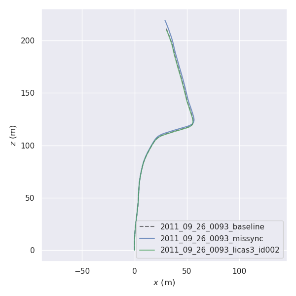
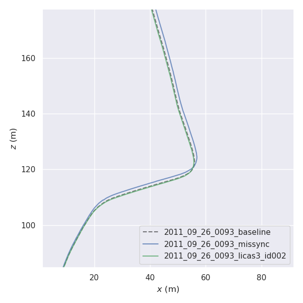
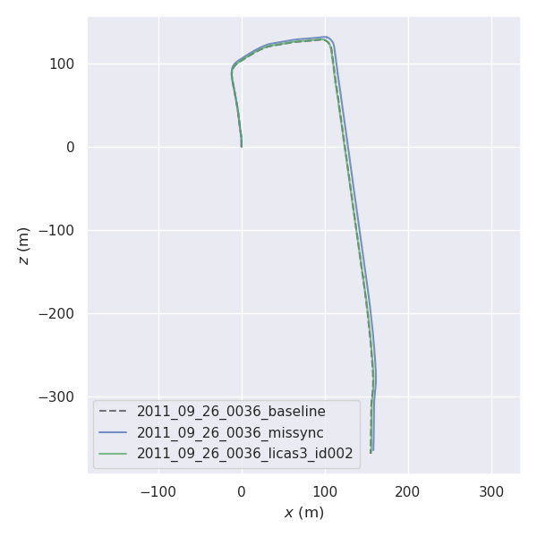
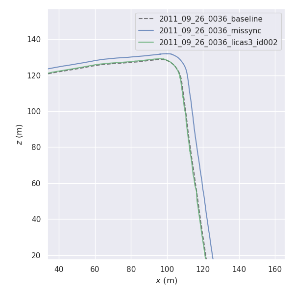

# Evaluation over off-the-shelf SLAM algorithm, LIMO: end-to-end level

Heads-up, this end-to-end evaluation will be a bit complicated since it will start working with ROS1 and other old repos.
To get tensorflow-gpu 1.14, docker, ROS, python and NVIDIA drivers all happy, I end up with forking a few open source 
projects and fix some bugs, including:

- https://github.com/johannes-graeter/limo (original limo)
- https://github.com/KleinYuan/limo (my fork)
- https://github.com/tomas789/kitti2bag (original kitti2bag)
- https://github.com/KleinYuan/kitti2bag (my fork)
- https://github.com/MichaelGrupp/evo (a popular project to evaluate trajectories)

## Overview

We are using this LIMO implementation (https://github.com/johannes-graeter/limo) as our SLAM methods for benchmark. Namely,
all we need is to show:

- [X] Baseline Performance of LIMO
- [X] Performance of LIMO with mis-synchronization introduction
- [X] Performance of LIMO with LiCaS3 to compensate tne mis-synchronization

And hopefully, we shall see the LiCaS3 performance is better than the mis-synchronized one and close to the baseline.

Therefore, we have the following 6 steps:

- [X] setup LIMO
- [X] setup benchmark evaluation and visualization scripts
- [X] create baseline rosbags and get baseline results
- [X] create mis-synchronized rosbags and get mis-synchronized results
- [X] create LiCaS3 inferenced rosbags abd get LiCaS3 results
- [X] compare three results

## Step 1 / 6: Setup LIMO

### Substep 1.1: Build the Project
 
After some research, I found out that there are not really too many open source LiDAR-Visual-Odometry codes, especially with 
benchmarks with either KITTI or Newer College. 
The only one that I found is the LIMO: https://github.com/johannes-graeter/limo

You can just follow from the ["Requirements" steps in the README](https://github.com/johannes-graeter/limo#requirements) 
to try to set it up, namely:

1. Install Ceres: just follow the steps in the link http://ceres-solver.org/installation.html with only change as using `sudo make install` at last
2. Install libpng++ `sudo apt-get install libpng++-dev`
3. Install ROS melodic: https://wiki.ros.org/melodic/Installation
4. Install catkin_tools: `sudo apt-get install python-catkin-tools`
5. Install opencv_apps: `sudo apt-get install ros-melodic-opencv-apps`
6. Install git: `sudo apt-get install git`

However, you may meet the launch error:

```
`error: expected constructor, destructor, or type conversion before 
‘(’ token PLUGINLIB_DECLARE_CLAS`: How to fix is to replace the `PLUGINLIB_DECLARE_CLAS(AXX, BXX, AXX::BXX, ...)`
 into `PLUGINLIB_EXPORT_CLAS(AXX::BXX, ...)`
```

How to fix is to replace the `PLUGINLIB_DECLARE_CLAS(AXX, BXX, AXX::BXX, ...)` into `PLUGINLIB_EXPORT_CLAS(AXX::BXX, ...)`

I have met this for three files:

1. ~/catkin_ws/src/feature_tracking/viso_feature_tracking_ros_tool/src/feature_tracking_contour_roi/feature_tracking_contour_roi_nodelet.cpp
2. ~/catkin_ws/src/feature_tracking/image_preproc_ros_tool/src/resize/resize_nodelet.cpp
3. ~/catkin_ws/src/feature_tracking/image_preproc_ros_tool/src/gamma_correction/gamma_correction_nodelet.cpp

After fixing this, the build is successful. The credits go to those two posts:
1. https://blog.csdn.net/weixin_42344264/article/details/105617317
2. https://github.com/KumarRobotics/msckf_vio/pull/72

And I have documented this in the [README of my fork](https://github.com/KleinYuan/limo#build-issue).

Please be noted that after the fix, you shall build the project again.

(As a fast follow, I may try to help the original author fix the docker images for a more encapsulated environment setup, well,
when I have time :( )

### Substep 1.2: Run the Project

Open three terminals:

```
# shell 1
# make sure you do with setup.bash instead of setup.sh
source devel_limo_release/setup.bash
roslaunch demo_keyframe_bundle_adjustment_meta kitti_standalone.launch
```

```
# shell 2
rviz -d src/limo/demo_keyframe_bundle_adjustment_meta/res/default.rviz
```

```
# shell 3
rosbag play XXX.bag
```

Then you will see the process running and then the results will be dumped to `/tmp/pose_dump.txt`.

It shall be noted that our purpose of the experiments is to validate the impact of mis-synchronization between mono-camera and
LiDAR. Namely, we will need to turn off the semantic labels for the baseline. Here is how you can do it:

https://github.com/KleinYuan/limo/commit/5695c6d496f8dc969b09811884b4b0b19474a3d2

After you have updated the above, run the project again.

The project only provides 04.bag and 01.bag who corresponds to `04: 2011_09_30_drive_0016` and `01: 2011_10_03_drive_0042`. In our
original paper, we use reserved 2011_09_26 drives for testing. It's better that we use the same so that we can correspond the SLAM
results with other reported inference results.

Namely, to achieve that, we will need to create our own bag files like what the author provided, which refers to Step 3. In another word,
the 04.bag or 01.bag provided by this project is only used to validate the project can run. 

## Step 2 / 6: Setup benchmark evaluation and visualization scripts

Since we have the `pose.txt` file from the example 04.bag or 01.bag, the next step is to find a way to visualize it and get some 
numerical results.

Copy the `pose_dump.txt` and rename it to [baseline_pose_01.txt](assets/baseline_pose_01.txt).
Download the ground truth pose file from KITTI website and rename it to [gt_pose_01.txt](assets/gt_pose_01.txt).

```
# install the evo: https://github.com/MichaelGrupp/evo
pip install evo --upgrade --no-binary evo
```

Then do the following to visualize the trajectory, xyz, rpy
```
evo_traj kitti limo/baseline_pose_01.txt  --ref=limo/gt_pose_01.txt -p --plot_mode=xz
```


Then do the following to get the actual number
```
evo_ape kitti limo/gt_pose_01.txt limo/baseline_pose_01.txt -va --plot --plot_mode xz --save_results baseline_gt_01.zip
```

And you will get 

```
Aligning using Umeyama's method...
Rotation of alignment:
[[ 0.99986274 -0.00514851  0.01574801]
 [ 0.00531613  0.99992947 -0.0106206 ]
 [-0.01569222  0.01070286  0.99981959]]
Translation of alignment:
[-1.13089177 -0.73158731  0.10320626]
Scale correction: 1.0
--------------------------------------------------------------------------------
Compared 1100 absolute pose pairs.
Calculating APE for translation part pose relation...
--------------------------------------------------------------------------------
APE w.r.t. translation part (m)
(with SE(3) Umeyama alignment)

       max	12.642620
      mean	5.450603
    median	5.786715
       min	0.394462
      rmse	6.106905
       sse	41023.718002
       std	2.754128
```

I can do this smoothly without any issues. This can be achieved effortlessly in the host machine (not in the docker).


## Step 3/6: Create Baseline Rosbags and Get Baseline Results

After some research, I have found the https://github.com/tomas789/kitti2bag is the best project to create bagfiles from raw KITTI data.
However, I have found a few issues:

- [X] the limo uses different naming conventions for topics
- [X] the limo TF/TF_static structures are different
- [X] the limo timestamps start is different
- [X] the kitti2bag is quite old and there are many things are broken

To get it work, I have, again, forked it to https://github.com/KleinYuan/kitti2bag, which has all the fix/changes for our purpose.

So, just follow [the README](https://github.com/KleinYuan/kitti2bag/blob/master/README.md) and you should be able to convert any KITTI
raw data into bags that are compatible to the LIMO project.

In our experiments, we use 2011_09_26_0036 and 2011_09_26_0093 for testing.

With the bags, run Step1-Substep 1.2 and Step2 to get the results and copy them under this limo folder:

- [2011_09_26_0036_baseline.txt](assets/2011_09_26_0036_baseline.txt)
- [2011_09_26_0093_baseline.txt](assets/2011_09_26_0093_baseline.txt)

## Step 4/6: Create Mis-synchronized Rosbags and Get Mis-synchronized results

Since in our paper, we treat the camera as the faster sensor, namely, in a buffer, we are looking for the camera frame from a bunch of 
frames to match the targeting LiDAR. Namely, we would like to generate some synthesis rosbag with the LiDAR data slower than the camera.

The script of [kitti_ros_runner.py](kitti_ros_runner.py) is to achieve that. I have again copied many duplicate codes from 
[training_data_serialization/utils](../../training_data_serialization/utils) to make this evaluation more independent, in cae
future researchers would like to use this as an off-the-shelf tool.

To enter the container of LiCaS3 project, the one you use for training (`root@2080ti:~/lcsync/experiments/benchmark# `) and run the following:

```
export CUDA_VISIBLE_DEVICES=0 && export PYTHONPATH='.' && python kitti_ros_runner.py create_lidar_missync_rosbag \
--bag_fp /root/kitti/tmp/2011_09_26/kitti_2011_09_26_drive_0036_synced.bag \
--max_shift 10 \
--shift_chance 0.5
```


You shall get a rosbag named as `/root/kitti/tmp/2011_09_26/kitti_2011_09_26_drive_0036_synced.bag.lidar_missync.bag`.

And this is the bag containing a LiDAR-Camera mis-synchronized sequences to simulate the real-world situation. You can play with 
the max shift or shift chance. Just to make sure the `max_shift` shall be the same as your LiCaS3 model input.

Do this to 2011_09_26_0036 and 2011_09_26_0093.

Next, run Step1-Substep 1.2 and Step2 to get the results and copy them under this limo folder:

- [2011_09_26_0036_missync.txt](assets/2011_09_26_0036_missync.txt)
- [2011_09_26_0093_missync.txt](assets/2011_09_26_0093_missync.txt)


## Step 5/6: Create LiCaS3 Inferenced Rosbags and Get LiCaS3 Results

Now, you have the baseline and mis-sync results. The next is to show how LiCaS3 can make it better.

I have written an inference function, which runs online with the bags in the same script: [kitti_ros_runner.py](kitti_ros_runner.py).

In the last step, we use the `max_shift = 10`, and namely, you would like to use the LiCaS3-h model with id as id_002, referring 
to the [h_models.yaml](../evaluation_over_datasets/configs/h_models.yaml). Therefore, your command will be:

(you will need to update the test data folder path in `kitti_benchmark_template.yaml` to only contain 
`kitti_2011_09_26_drive_0036_synced`)

```
export CUDA_VISIBLE_DEVICES=0 && export PYTHONPATH='.' && python kitti_ros_runner.py process_a_bag_with_tf_protobuf \
--bag_fp /root/kitti/tmp/2011_09_26/kitti_2011_09_26_drive_0036_synced.bag.lidar_missync.bag \
--benchmark_config_template_fp ../evaluation_over_datasets/configs/kitti_benchmark_template.yaml \
--models_config_fp ../evaluation_over_datasets/configs/h_models.yaml \
--model_type h \
--dataset_name kitti \
--model_id id_h002
```


Again, this will happen in the container of LiCaS3 project, the one you use for training (`root@2080ti:~/lcsync/experiments/benchmark# `).

And you will obtain a bag named `/root/kitti/tmp/2011_09_26/kitti_2011_09_26_drive_0036_synced.bag.lidar_missync.bag.licas3_bag.id_002.bag`.

Do this to 2011_09_26_0036 and 2011_09_26_0093.

Next, run Step1-Substep 1.2 and Step2 to get the results and copy them under this limo folder:

- [2011_09_26_0036_licas3_id002.txt](assets/2011_09_26_0036_licas3_id002.txt)
- [2011_09_26_0093_licas3_id002.txt](assets/2011_09_26_0093_licas3_id002.txt)

Now, you have them all!

Please be aware that the way that we load the calibration data assuming all the data in the folder shares the same one. Namely,
if you would like to do benchmarks for different sequences, whose calibration data are different, you shall do them separately. 
Or, try to optimize the code to make it better :).


## Step 6/6: Compare three Results

Finally, you have all the results:

2011_09_26_0036:
- [2011_09_26_0036_baseline.txt](assets/2011_09_26_0036_baseline.txt)
- [2011_09_26_0036_missync.txt](assets/2011_09_26_0036_missync.txt)
- [2011_09_26_0036_licas3_id002.txt](assets/2011_09_26_0036_licas3_id002.txt)

2011_09_26_0093:
- [2011_09_26_0093_baseline.txt](assets/2011_09_26_0093_baseline.txt)
- [2011_09_26_0093_missync.txt](assets/2011_09_26_0093_missync.txt)
- [2011_09_26_0093_licas3_id002.txt](assets/2011_09_26_0093_licas3_id002.txt)

### Visualization

Now, go to the host machine and run:

```
evo_traj kitti assets/2011_09_26_0093_missync.txt assets/2011_09_26_0093_licas3_id002.txt \
--ref=assets/2011_09_26_0093_baseline.txt -p --plot_mode=xz
```

And you will obtain the plot for 2011_09_26_0093. You can either zoom in it or directly save it to a png and move it to 
this folder:



And the zoomed in one is like:




Do the same for 2011_09_26_0036:

```
evo_traj kitti assets/2011_09_26_0036_missync.txt  assets/2011_09_26_0036_licas3_id002.txt --ref=assets/2011_09_26_0036_baseline.txt -p --plot_mode=xz
```




And the zoomed in one is like:




### Numerical Results

Technically, you can also obtain the numerical results between baseline and missync:

```
evo_ape kitti assets/2011_09_26_0093_baseline.txt assets/2011_09_26_0093_missync.txt -vs --plot --plot_mode xz \
--save_results 2011_09_26_0093_baseline_vs_missync.zip
```

yielding:

```
--------------------------------------------------------------------------------
Correcting scale...
Scale correction: 0.9745893537591105
--------------------------------------------------------------------------------
Compared 431 absolute pose pairs.
Calculating APE for translation part pose relation...
--------------------------------------------------------------------------------
APE w.r.t. translation part (m)
(scale corrected)

       max	2.645538
      mean	1.357279
    median	1.295640
       min	0.000000
      rmse	1.474006
       sse	936.430824
       std	0.574881

--------------------------------------------------------------------------------
```

And

```
evo_ape kitti assets/2011_09_26_0036_baseline.txt assets/2011_09_26_0036_missync.txt -vs  \
--plot --plot_mode xz --save_results 2011_09_26_0036_baseline_vs_missync.zip
```

yielding:

```
--------------------------------------------------------------------------------
Correcting scale...
Scale correction: 1.0001108367680265
--------------------------------------------------------------------------------
Compared 802 absolute pose pairs.
Calculating APE for translation part pose relation...
--------------------------------------------------------------------------------
APE w.r.t. translation part (m)
(scale corrected)

       max	6.550302
      mean	3.998194
    median	4.755241
       min	0.000000
      rmse	4.336492
       sse	15081.740598
       std	1.679169

--------------------------------------------------------------------------------
```

However, before you can obtain the numerical results between baseline and licas3_idh002, there are something you need to do. 
The cause is that the number of poses in the txt is not the same and the limo does not yield the any timestamps. If you directly
use the output for evo evaluation, you will see errors complaining about the un-matched number.

Namely, you will need to let the limo project yield the timestamp for each row. I have a branch for that: https://github.com/KleinYuan/limo/pull/1, 
which is quite straightforward. You either add this changes you your limo or checkout to this branch. Then you need to rebuild the limo
project and re-generate the files:

2011_09_26_0036:
- [2011_09_26_0036_baseline_stamped.txt](assets/2011_09_26_0036_baseline_stamped.txt)
- [2011_09_26_0036_licas3_id002_stamped.txt](assets/2011_09_26_0036_licas3_id002_stamped.txt)

2011_09_26_0093:
- [2011_09_26_0093_baseline_stamped.txt](assets/2011_09_26_0093_baseline_stamped.txt)
- [2011_09_26_0093_licas3_id002_stamped.txt](assets/2011_09_26_0093_licas3_id002_stamped.txt)

Then you will need to use the [evo_matcher.py](evo_matcher.py) to created matched txts:

```
python evo_matcher.py match --fn1 assets/2011_09_26_0093_baseline_stamped.txt --fn2 assets/2011_09_26_0093_licas3_id002_stamped.txt 
```

To get:

2011_09_26_0093:
- [2011_09_26_0093_baseline_stamped.txt.matched.txt](assets/2011_09_26_0093_baseline_stamped.txt.matched.txt)
- [2011_09_26_0093_licas3_id002_stamped.txt.matched.txt](assets/2011_09_26_0093_licas3_id002_stamped.txt.matched.txt)

Then you can run:

```
evo_ape kitti assets/2011_09_26_0093_baseline_stamped.txt.matched.txt \
assets/2011_09_26_0093_licas3_id002_stamped.txt.matched.txt -vs --plot \
--plot_mode xz --save_results 2011_09_26_0093_baseline_vs_licas3_id002_matched.zip
```

And it will yield the follows:

```
--------------------------------------------------------------------------------
Correcting scale...
Scale correction: 1.010193530263633
--------------------------------------------------------------------------------
Compared 330 absolute pose pairs.
Calculating APE for translation part pose relation...
--------------------------------------------------------------------------------
APE w.r.t. translation part (m)
(scale corrected)

       max	3.668943
      mean	1.018751
    median	0.857220
       min	0.000000
      rmse	1.225836
       sse	495.882266
       std	0.681777

--------------------------------------------------------------------------------
```

Now you see that for 2011_09_26_0093, we have

| Run | APE RMSE (m) |
| ------------- | ------------- |
| Mis-Sync  | 1.474006 |
| LiCaS3  | 1.225836 |

And do the same to the 2011_09_26_0036:

```
python evo_matcher.py match --fn1 assets/2011_09_26_0036_baseline_stamped.txt --fn2 assets/2011_09_26_0036_licas3_id002_stamped.txt
```

to get:

2011_09_26_0036:
- [2011_09_26_0036_baseline_stamped.txt.matched.txt](assets/2011_09_26_0036_baseline_stamped.txt.matched.txt)
- [2011_09_26_0036_licas3_id002_stamped.txt.matched.txt](assets/2011_09_26_0036_licas3_id002_stamped.txt.matched.txt)

Then you can run:

```
evo_ape kitti assets/2011_09_26_0036_baseline_stamped.txt.matched.txt \
assets/2011_09_26_0036_licas3_id002_stamped.txt.matched.txt -vs --plot \
--plot_mode xz --save_results 2011_09_26_0036_baseline_vs_licas3_id002_matched.zip
```

yielding:

```
--------------------------------------------------------------------------------
Correcting scale...
Scale correction: 1.00192413645401
--------------------------------------------------------------------------------
Compared 627 absolute pose pairs.
Calculating APE for translation part pose relation...
--------------------------------------------------------------------------------
APE w.r.t. translation part (m)
(scale corrected)

       max	9.446947
      mean	2.351335
    median	1.791148
       min	0.000000
      rmse	2.958743
       sse	5488.859404
       std	1.795935

--------------------------------------------------------------------------------

```


Now you see that for 2011_09_26_0036, we have

| Run | APE RMSE (m) |
| ------------- | ------------- |
| Mis-Sync  | 4.336492 |
| LiCaS3  | 2.958743 |


And namely, you have:


APE RMSE (m):

| Run | 2011_09_26_0093| 2011_09_26_0036 |
| ------------- | ------------- |------------- |
| Mis-Sync  | 1.474006 | 4.336492 |
| LiCaS3  | **1.225836** | **2.958743** |

This is what we report in Table VI.

# Author's Note for Future Researchers

For future researchers who are interested in this topic and would like to compare with my results:

If you really have difficulty training the model due to software issues, I 
have provided all raw end-to-end benchmark data under [assets](assets) folder. This will allow you to plot my results
on the same figure with yours without doing the training/inference, making your research life easier :)

So, if you are using a very different approach or develop based on a codebase that is totally different from
mine, I would suggest you just take the results and compare. However, if your work is strongly based on mine, 
I would suggest you go through this project thoroughly. For any academic questions, please don't hesitate to 
email me: [kaiwen@ece.ubc.ca](kaiwen@ece.ubc.ca).
